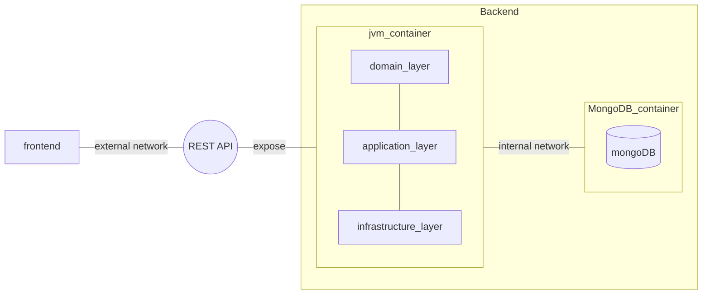

---

title: Architecture
nav_order: 3
parent: Report

---

# Architecture

## Backend architecture
We chose to implement the system backend following the **hexagonal architecture** (_ports and adapters_ architecture),
in which the application is divided into three main layers:
- **domain layer**: contains the domain model, which contains the business logic of the application;
- **application layer**: contains the application services, which orchestrate the use cases of the application, and the
ports that define the contracts for the infrastructure layer;
- **infrastructure layer**: contains the adapters, which are the implementations of the ports defined in the application
layer, and the technical details of the application, such as the web server.
