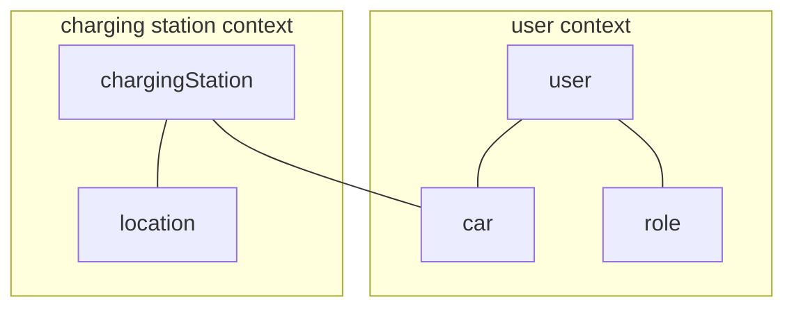
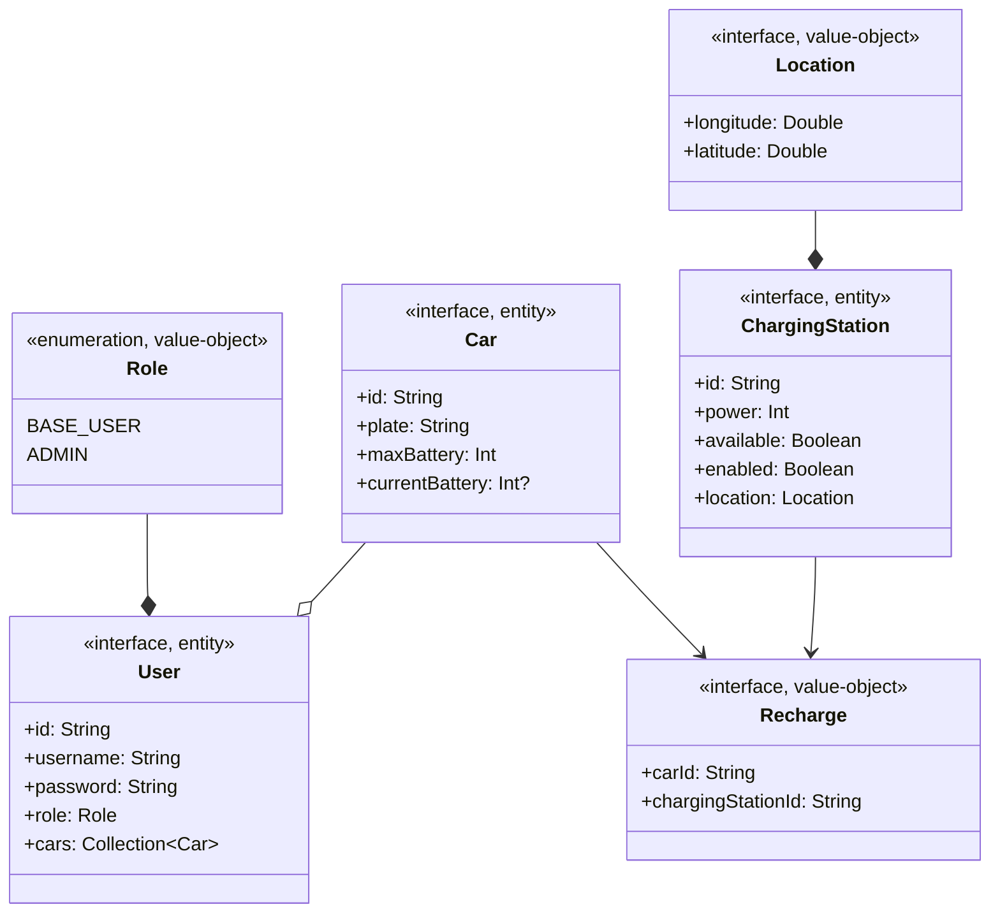

---

title: Domain-Driven Design (DDD)
nav_order: 2
parent: Report

---

# Domain-Driven Design (DDD)

## Ubiquitous language

- **User**: a registered person who logins to use the system;
- **Role**: the role of the user (base user or administrator);
- **Location**: a pair of coordinates (longitude, latitude);
- **Charging station**: a device in a specified location used to charge electric cars;
- **Car**: an electric car that needs its battery to be charged periodically.

## Context map

## Domain model

