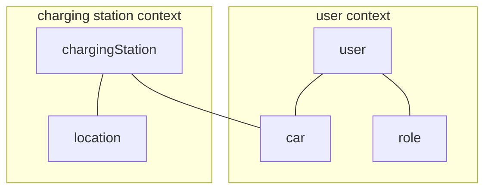

---

title: Domain-Driven Design (DDD)
nav_order: 2
parent: Report

---

# Domain-Driven Design (DDD)

## Ubiquitous language

First of all we defined the ubiquitous language:

- **User**: a registered person who logins to use the system;
- **Role**: the role of the user (base user or administrator);
- **Location**: a pair of coordinates (longitude, latitude);
- **Charging station**: a device in a specified location used to charge electric cars;
- **Car**: an electric car that needs its battery to be charged periodically;
- **Recharge**: the process of charging a car at a charging station.

## Context map

We identified two **bounded contexts**:
- **user context**: contains the entities related to the users, such as their cars and roles;
- **charging station context**: contains the entities related to the charging stations, such as their location.
The two contexts are connected by the car entity, because of the recharge concept.

## Domain model

We modeled the concepts of the domain, already described in the ubiquitous language, assigning to each of them the
appropriate building block, also identifying their properties and the relationships between them.

Starting from the main concepts shown in the diagram we identified others related models, such as:
- **domain events**: events that are emitted when something related to the recharges happens in the domain:
  - _RechargeUpdate_: emitted when during a recharge the battery level of the car is incremented;
  - _ChargingStationStateUpdated_: emitted when the state of a charging station is updated;
  - _RechargeCompleted_: emitted when a recharge is completed;
- **services**: interfaces that define the use cases:
  - _UserService_: defines the use cases related to the users;
  - _CarService_: defines the use cases related to the cars;
  - _ChargingStationService_: defines the use cases related to the charging stations;
  - _RechargeService_: defines the use cases related to the recharges;
  - _LocationService_: defines the use cases related to the locations;
  - _SearchChargingStationService_: defines the use cases related to the search of the charging stations;
- **repositories**: interfaces that provide storage facilities:
  - _UserRepository_: provides storage facilities for the users and their cars;
  - _ChargingStationRepository_: provides storage facilities for the charging stations;
  - _RechargeRepository_: provides storage facilities for the recharges.
