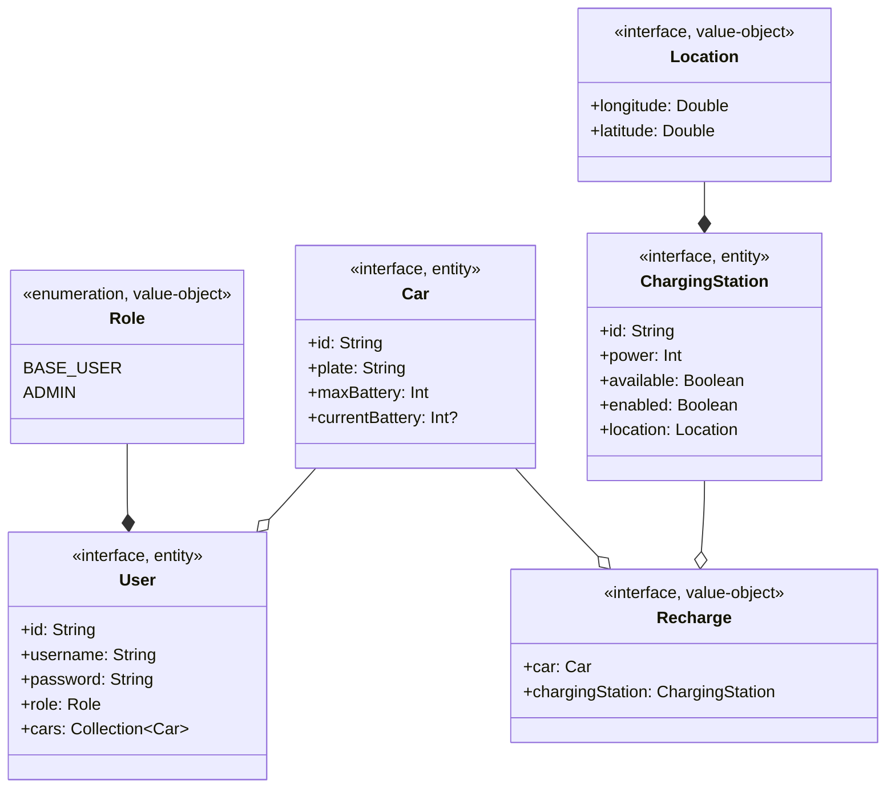

---

title: Domain diagram
nav_order: 3
parent: Report

---

# Domain diagram

```mermaid
---
config:
  class:
    hideEmptyMembersBox: true
---
classDiagram
    class User {
        <<interface, entity>>
        +id: String
        +username: String
        +password: String
        +role: Role
        +cars: Collection~Car~
    }
    class Role {
        <<enumeration, value-object>>
        BASE_USER
        ADMIN
    }
    class Car {
        <<interface, entity>>
        +id: String
        +plate: String
        +maxBattery: Int
        +currentBattery: Int?
    }
    class ChargingStation {
        <<interface, entity>>
        +id: String
        +power: Int
        +available: Boolean
        +enabled: Boolean
        +location: Location
    }
    class Location {
        <<interface, value-object>>
        +longitude: Double
        +latitude: Double
    }
    class Recharge {
        <<interface, value-object>>
        +car: Car
        +chargingStation: ChargingStation
    }
    Role --* User
    Car --o User
    Location --* ChargingStation
    Car --o Recharge
    ChargingStation --o Recharge
```